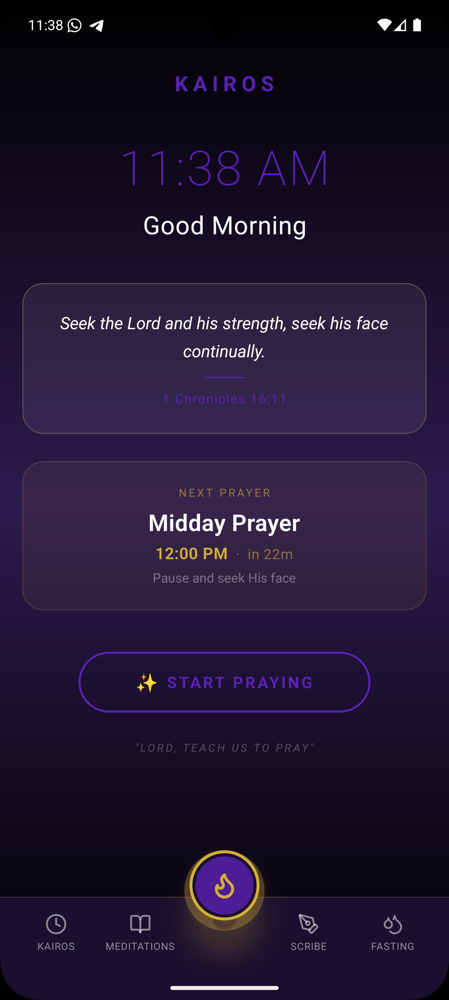

# 🕊️ Kairos: The Divine Moment

**Kairos** is a high-performance, beautifully designed React Native meditation application. It is built to help users "redeem the time" by providing daily spiritual nourishment through curated scriptures, apostolic wisdom, and deep meditations.

The name **Kairos** (Greek: καιρός) represents an opportune time and place—a "God-moment."

---

## 🚀 The Vision

Kairos isn't just an app; it's a spiritual tool. Version 1 focuses on a zero-backend, high-efficiency delivery of daily content.

- **Daily Rotation:** Scriptural content cycles based on the day of the year to ensure a fresh experience every 24 hours.
- **Apostolic Wisdom:** Curated quotes from fathers of faith (Watchman Nee, Kenneth Hagin, Joshua Selman, etc.).
- **Performance First:** Built with React Native (Expo) using optimized memory management for static assets.

## 🛠️ Tech Stack

- **Framework:** React Native / Expo (Router)
- **Language:** TypeScript
- **Styling:** NativeWind (Tailwind CSS for React Native)
- **Animations:** Expo Linear Gradient (Native Performance)

## 📁 Project Structure

```text
├── app/                  # Expo Router directory (Navigation)
├── components/           # Reusable UI components (Navbar, PrayerTimer, etc.)
├── constants/            # The Engine (Daily Verses, Psalms, Quotes, Prayer Times)
├── assets/               # High-fidelity brand assets & icons
├── hooks/                # Custom React hooks (usePrayerState, usePrayerTimes, etc.)
├── lib/                  # Utility libraries (notifications, scribe-db)
├── install/              # Installation scripts or assets
├── android/              # Android build configuration
└── [config files]        # package.json, tsconfig.json, babel.config.js, etc.
```

## 🚀 Getting Started

### Prerequisites

- Node.js (v18 or later)
- npm or yarn
- Expo CLI
- For mobile development: Android Studio (for Android) or Xcode (for iOS)

### Installation

1. Clone the repository
2. Install dependencies:
   ```bash
   npm install
   ```

### Running the App

- Start the Expo development server:
  ```bash
  npx expo start
  ```
- For Android:
  ```bash
  npx expo run:android
  ```
- For iOS:
  ```bash
  npx expo run:ios
  ```
- For Web:
  ```bash
  npx expo start --web
  ```

### Building for Production

Use EAS Build for production builds:

```bash
npx eas build --platform android
npx eas build --platform ios
```

## 📱 App Preview

Below is a preview of the Kairos app experience.



> Add your screenshot as `assets/images/landing-home.png` to display the preview here.

## 🖼️ Assets & Resources

The core visual resources for the app are stored in `assets/images/`:

- `favicon.png` — favicon or web preview asset
- `icon.png` — app icon / launcher icon
- `splash.png` — splash screen background

You can also add screenshot files for the README:

- `assets/images/landnig-home.png` — main landing/home preview screenshot

## 📄 License

This project is licensed under the MIT License. See [LICENSE](LICENSE) for details.
